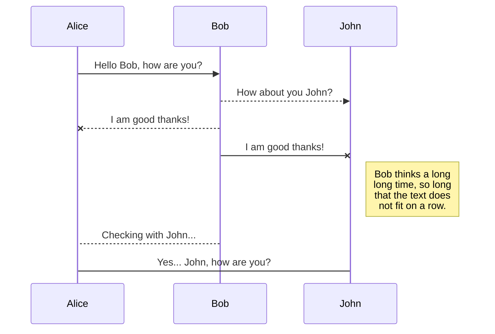
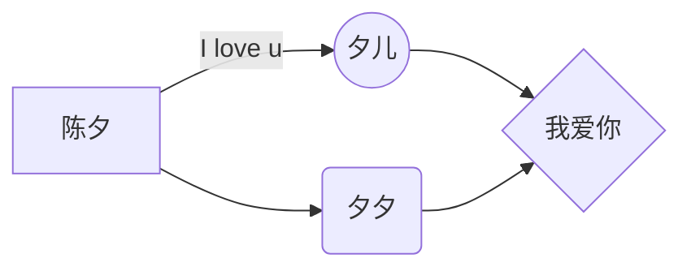


# Welcome to StackEdit!  
  
Hi! I'm your first Markdown file in **StackEdit**. If you want to learn about StackEdit, you can read me. If you want to play with Markdown, you can edit me. Once you have finished with me, you can create new files by opening the **file explorer** on the left corner of the navigation bar.  
  
  
# 让人眼前一亮的Android面试题集锦（持续更新）
  
本内容开始于2019-03-23，持续更新

在开始整理该内容时，网上搜罗一大圈，发现很多内容都时间比较久远，内容不更新，而且有的错误，比如一篇文章介绍Android动画两种，但其实Android中有3中动画的

于带着前人的智慧和自己开发中的经验来整理一篇关于Android的面试题，题目就叫**让人眼前一亮的Android面试题集锦**

当然不仅仅是为了面试而面试，通过整理这些能够总结之前的经验，提升自己的能力，同时也能分享一些好的idea给大家，我觉得非常有意义

**转载请标明出处**，有任何疑问的地方，可以通过邮件联系到我

>* @StartTime：2019-03-23
>* @LastTime：2019-03-31
>* @Email：qyddai@gmail.com
>* @Author ： sunst /  qy
>* @Version：3.0
>* @CommitRecords：
> > 2019-03-23 version1.0 基础知识使用Stackedit模版
> > 2019-03-31 version2.0新增内容
> > 2019-04-01 version3.0新增内容


## Android介绍
Android是一个开源的操作系统，主要用于移动设备，比如手机，平板电脑，它是一种基于Linux的开放源代码软件栈，应用于ARM平台，但不仅限于ARM，通过编译控制，在X86等体系结构的机器上同样可以运行，并且它提供了丰富的组件，允许开发人员编写可执行基本和高级功能的应用程序

## Android系统架构
与其他操作系统一样，Android也采用分层的架构设计，从高到低分别是系统应用层（System Apps），Java API 框架层（Java API Framework），Android系统运行层（包括Android Runtime和原生态的C/C++库 Native C/C++ Libraries）、硬件抽象层（Hardware Abstraction Layer）、Linux内核层（Linux Kernel）。如下图所示：


下面由上至下分别介绍各层

### 1. 系统应用层
所有安装在手机上的系统应用都属于这一层，用户自己开发的应用也属于这一层

### 2. Java API 框架层
Android OS的整个功能集可以通过用Java语言编写的API来获得，如：
>* 一个丰富且可扩展的View System： 可以使用它来构建应用程序的UI，包括列表，网格，文本框，按钮，甚至可嵌入的Web浏览器；
>* Content Providers： 可让应用访问其他应用的数据，例如通讯录应用，或共享自己的数据。
>* Activity Manager： 负责管理应用程序的生命周期并提供一个通用的导航返回栈；
>* Resource Manager： 提供对非编码资源，如本地字符串，图形，和布局文件；
>* Notification Manager： 为应用程序提供在状态栏中显示自定义的消息提醒；

### 3.  Android系统运行层
这一层包括Android Runtime和原生态的C/C++库。
* 原生态的C/C++库

许多核心的Android系统组件和服务（如ART和HAL）都是使用本地代码构建的，需要使用C和C ++编写的本机库。
Android平台提供Java框架API以将这些本地库中的一些功能展示给应用程序。 例如，您可以通过Android框架的Java OpenGL API访问OpenGL ES，以添加对在应用程序中绘制和操作2D和3D图形的支持。WebKit提供了浏览器支持等
* Android运行时

包括了ART虚拟机（Android 5.0之前是Dalvik虚拟机，ART模式与Dalvik模式最大的不同在于，在启用ART模式后，系统在安装应用的时候会进行一次预编译AOT，先将代码转换为机器语言存储在本地，这样在运行程序时就不会每次都进行一次编译了，执行效率也大大提升。如果您的应用在 ART 上运行效果很好，那么它应该也可在 Dalvik 上运行，但反过来不一定。），每个Java程序都运行在ART虚拟机上，该虚拟机专门针对移动设备进行了定制，每个应用都有其自己的 Android Runtime (ART) 实例

### 4. 硬件抽象层（Hardware Abstraction Layer）
 硬件抽象层 （HAL）提供了将设备硬件功能展示给更高级Java API框架的标准接口。 HAL由多个库模块组成，其中每个模块都为特定类型的硬件组件（如相机或蓝牙模块）实现接口。 当框架API调用访问设备硬件时，Android系统会自动为该硬件组件加载库模块

### 5. Linux内核层
Android是基于Linux内核的（Linux内核提供了安全性、内存管理、进程管理、网络协议和驱动模型等核心系统服务），Linux内核层为各种硬件提供了驱动程序，如显示驱动、相机驱动、蓝牙驱动、电池管理等等

## MVC设计模式

<font color=#0099ff size=4 face="黑体">MVC模式的结构分为三部分，实体层的Model，视图层的View，以及控制层的Controller</font>

-   View层其实就是程序的UI界面，用于向用户展示数据以及接收用户的输入
-   Model层就是JavaBean实体类，用于保存实例数据
-   Controller控制器用于更新UI界面和数据实例

例如：View层接受用户的输入，然后通过Controller修改对应的Model实例；同时，当Model实例的数据发生变化的时候，需要修改UI界面，可以通过Controller更新界面；View层也可以直接更新Model实例的数据

## MVP设计模式

### 1. 引入的场景

MVP模式是MVC模式在Android上的一种变种，在Android的架构中Activity,Fragment布局的xml相当于View。实际的开发过程中，Activity和Fragment占据了大部分的开发工作，这就导致了在实际开发中View层太过耦合，一不小心，几次代码迭代过后，一个Activity或者Fragment中的代码就有几千行，有时候修改个功能在笨重的代码中摸爬滚打半天才找到关键点，对于不熟悉代码的开发者来说（或者接手前人编写代码的质量过低）维护起来及其困难，所以将视图和业务逻辑代码分开势在必行

Google在Github上开源的<font color=#0099ff size=4 face="黑体">[todo-mvp](https://github.com/googlesamples/android-architecture/tree/todo-mvp/)</font>项目就是MVP的前身。这种设计模式（或者说代码结构）专门是为优化Activity和Fragment的代码而产生的，但是并不一定这个模式就非常好，只不过有它的好处的初衷：

想让结构更加的清晰，逻辑耦合度降低

### 2. MVP的介绍
MVP 全称是Model - View - Presenter ，是模型(model)－视图(view)－呈现器(presenter)的缩写

>* <b>Model：</b><font color=#dd0000 size=4 face="黑体">业务逻辑和数据处理(数据库存储操作，网络数据请 求，复杂算法，耗时操作)</font>
>* <b>View :</b> <font color=#dd0000 size=4 face="黑体">对应于Activity，负责View的绘制以及与用户交互</font>
>* <b>Presenter：</b><font color=#dd0000 size=4 face="黑体">负责完成View于Model间的交互 (有一点还需要注意，presenter是双向绑定的关系，因此，在设计的时候就要注意接口和抽象的使用，尽可能的降低代码的耦合度，这也是mvp的宗旨)</font>

按照MVC的分层，Activity和Fragment属于View层，用于展示UI界面，以及接收用户的输入，此外还要承担一些生命周期的工作。Activity是在Android开发中充当非常重要的角色，特别是TA的生命周期的功能，所以开发的时候我们经常把一些业务逻辑直接写在Activity里面，这非常直观方便，代价就是Activity会越来越臃肿，超过1000行代码是常有的事，而且如果是一些可以通用的业务逻辑（比如用户登录），写在具体的Activity里就意味着这个逻辑不能复用了。如果有进行代码重构经验的人，看到1000+行的类肯定会有所顾虑。因此，Activity不仅承担了View的角色，还承担了一部分的Controller角色，这样一来V和C就耦合在一起了，虽然这样写方便，但是如果业务调整的话，要维护起来就难了，所以有必要在Activity中，把View和Controller抽离开来，而这就是MVP模式的工作了

<font color=#0099ff size=4 face="黑体">MVP模式的核心思想：</font>

> MVP把Activity中的UI逻辑抽象成View接口，把业务逻辑抽象成Presenter接口，Presenter是Model和View之间的桥梁

### 3. MVP作用

-   分离了视图逻辑和业务逻辑，降低了耦合

-   Activity只处理生命周期的任务，代码变得更加简洁

-   视图逻辑和业务逻辑分别抽象到了View和Presenter的接口中去，提高代码的可阅读性

-   Presenter被抽象成接口，可以有多种具体的实现，所以方便进行单元测试

-   把业务逻辑抽到Presenter中去，避免后台线程引用着Activity导致Activity的资源无法被系统回收从而引起内存泄露和OOM

其中最重要的有三点：

#### （1） Activity 代码变得更加简洁

相信很多人阅读代码的时候，都是从Activity开始的，对着一个1000+行代码的Activity，看了都觉得难受。

使用MVP之后，Activity就能瘦身许多了，基本上只有FindView、SetListener以及Init的代码。其他的就是对Presenter的调用，还有对View接口的实现。这种情形下阅读代码就容易多了，而且你只要看Presenter的接口，就能明白这个模块都有哪些业务，很快就能定位到具体代码。Activity变得容易看懂，容易维护，以后要调整业务、删减功能也就变得简单许多。

#### （2）方便进行单元测试

一般单元测试都是用来测试某些新加的业务逻辑有没有问题，如果采用传统的代码风格（习惯性上叫做MV模式，少了P），我们可能要先在Activity里写一段测试代码，测试完了再把测试代码删掉换成正式代码，这时如果发现业务有问题又得换回测试代码，咦，测试代码已经删掉了！好吧重新写吧……

MVP中，由于业务逻辑都在Presenter里，我们完全可以写一个PresenterTest的实现类继承Presenter的接口，现在只要在Activity里把Presenter的创建换成PresenterTest，就能进行单元测试了，测试完再换回来即可。万一发现还得进行测试，那就再换成PresenterTest吧。

#### （3）避免 Activity 的内存泄露

Android APP 发生OOM的最大原因就是出现内存泄露造成APP的内存不够用，而造成内存泄露的两大原因之一就是Activity泄露（Activity Leak）（另一个原因是Bitmap泄露（Bitmap Leak））

> Java一个强大的功能就是其虚拟机的内存回收机制，这个功能使得Java用户在设计代码的时候，不用像C++用户那样考虑对象的回收问题。然而，Java用户总是喜欢随便写一大堆对象，然后幻想着虚拟机能帮他们处理好内存的回收工作。可是虚拟机在回收内存的时候，只会回收那些没有被引用的对象，被引用着的对象因为还可能会被调用，所以不能回收

Activity是有生命周期的，用户随时可能切换Activity，当APP的内存不够用的时候，系统会回收处于后台的Activity的资源以避免OOM

采用传统的MVC模式，一大堆异步任务和对UI的操作都放在Activity里面，比如你可能从网络下载一张图片，在下载成功的回调里把图片加载到 Activity 的 ImageView 里面，所以异步任务保留着对Activity的引用。这样一来，即使Activity已经被切换到后台（onDestroy已经执行），这些异步任务仍然保留着对Activity实例的引用，所以系统就无法回收这个Activity实例了，结果就是Activity Leak。Android的组件中，Activity对象往往是在堆（Java Heap）里占最多内存的，所以系统会优先回收Activity对象，如果有Activity Leak，APP很容易因为内存不够而OOM。

采用MVP模式，只要在当前的Activity的onDestroy里，分离异步任务对Activity的引用，就能避免 Activity Leak。

### 3. MVP使用示例
以最常用的网络数据请求为例

先来明确下MVP中各个环节的责任划分，然后照此进行代码布局

责任划分：
>* Model: 定义并实现获取数据操作(如数据库读取、网络加载)的接口
>* View: 定义并在Activity,Fragment等中实现用于界面处理(初始化，数据展示)的接口
>* Presenter: 定义用于调用Model中的数据请求方法的接口，实现此接口，并实现Model中定义的数据请求的接口

通过上面的介绍，MVP的主要特点就是把Activity里的许多逻辑都抽离到View和Presenter接口中去，并由具体的实现类来完成
#### Step 1/编写Model逻辑
数据请求接口(如数据库读取、网络加载)的定义：
```
/**
 * Model层接口---实现该接口的类负责实际的获取数据操作，如数据库读取、网络加载
 */
public interface IModel  {
   void getData(Model.LoadDataCallback callback);
}
```
数据请求接口的实现：
```
/**
 * 实现IModel接口，负责实际的数据获取操作（数据库读取，网络加载等），然后通过自己的接口（LoadDataCallback）反馈出去
 */
public class Model implements IModel {

    @Override
    public void getData(final LoadDataCallback callback) {
        //数据获取操作，如数据库查询、网络加载等
        new Thread() {
            @Override
            public void run() {
                try {
                    //模拟耗时操作
                    Thread.sleep(3000);
                    //获取到了数据
                    String data = "我是获取到的数据";
                    //将获取的数据通过接口反馈出去
                    callback.success(data);
                } catch (InterruptedException e) {
                    e.printStackTrace();
                    //获取数据失败的回调
                    callback.failure();
                }
            }
        }.start();
    }

    /**
     * 用于回传请求的数据的回传
     */
    public interface LoadDataCallback {

        void success(String taskId);

        void failure();
    }
}
```
#### Step 2/编写View逻辑
定义用于界面处理(初始化，数据展示)的接口
```
/**
 * View层接口---执行各种UI操作，定义的方法主要是给Presenter中来调用的
 */
public interface IView {

    void showLoadingProgress(String message);

    void showData(String text);
}
```
在Activity,Fragment等中对接口的实现
```
/**
 * 实现IView接口并实现各种UI操作的方法（其他的业务逻辑在Presenter中进行操作）
 */
public class ViewActivity extends AppCompatActivity implements IView {
    private Button mBtnShowToast;
    private TextView mText;
    private MyHandler mHandler = new MyHandler(ViewActivity.this);
    private IPresenter mPresenter;

    @Override
    protected void onCreate(Bundle savedInstanceState) {
        super.onCreate(savedInstanceState);
        setContentView(R.layout.activity_mvp);

        //实例化Presenter，并将实现了IView接口的类传入进去
        mPresenter = new Presenter(ViewActivity.this);

        mBtnShowToast = findViewById(R.id.btn_show_toast);
        mText = findViewById(R.id.text);

        mBtnShowToast.setOnClickListener(new View.OnClickListener() {
            @Override
            public void onClick(View v) {
                //通过Presenter来实现业务逻辑操作，View层只负责UI相关操作
                mPresenter.loadData();
            }
        });
    }

    @Override
    public void showLoadingProgress(final String message) {
        mHandler.post(new Runnable() {
            @Override
            public void run() {
                mText.setText(message);
            }
        });
    }

    @Override
    public void showData(final String text) {
        mHandler.post(new Runnable() {
            @Override
            public void run() {
                mText.setText(text);
            }
        });
    }

    private static class MyHandler extends Handler {

        //弱引用，防止内存泄露
        WeakReference<ViewActivity> weakReference;

        public MyHandler(ViewActivity activity) {
            this.weakReference = new WeakReference<ViewActivity>(activity);
        }

        @Override
        public void handleMessage(Message msg) {
            switch (msg.what) {
                case 1:
                    weakReference.get().mText.setText(msg.what);
                    break;
            }
        }
    }
}
```
#### Step 3/编写presenter逻辑(重点关注)
presenter层很重要，为什么这样说呢？
因为MVP模式中，View和Model是不直接交互的，而是通过presenter这个纽带来进行交互-----------View通过presenter对象来调用Model中数据请求的接口，而Model中数据请求的结果会通过presenter中定义的接口回调给presenter，然后presenter在通知给View。

定义用于调用Model中的数据请求方法的接口：
具体实现：
```
/**
 * Presenter层接口---控制Model层的数据操作及调用View层的UI操作来完成“中间人”工作
 */
public interface IPresenter {

    void loadData();

}
```
定义用于调用Model中的数据请求方法的接口，实现此接口，并实现M中定义的数据请求的接口
```
/**
 * Presenter层接口---控制Model层的数据操作及调用View层的UI操作来完成“中间人”工作.
 * 用于model和view的相关方法的调用
 */
public class Presenter implements IPresenter, Model.LoadDataCallback {

    private final IView mView;
    private final Model mModel;

    public Presenter(IView view) {
        mView = view;
        mModel = new Model();
    }

    @Override
    public void loadData() {
        mView.showLoadingProgress("加载数据中");
        mModel.getData(Presenter.this);
    }

    @Override
    public void success(String data) {
        mView.showData(data);
    }

    @Override
    public void failure() {

    }
}
```
大家要多看，多试验，最重要的是**理解思路**，Google官方的MVP代码大家可以去研读一下，是同一个模式，只不过它把好多接口集成在一个接口文件中，防止代码碎片化，大家研读时记住这一点，就不会困惑了。

## Android的四大组件是哪些，它们的作用

Activity：Activity是Android程序与用户交互的窗口，是Android构造块中最基本的一种，它需要为保持各界面的状态，做很多持久化的事情，妥善管理生命周期以及一些跳转逻辑

Service：后台服务于Activity，封装有一个完整的功能逻辑实现，接受上层指令，完成相关的事物，定义好需要接受的Intent提供同步和异步的接口

Content Provider：是Android提供的第三方应用数据的访问方案，可以派生Content Provider类，对外提供数据，可以像数据库一样进行选择排序，屏蔽内部数据的存储细节，向外提供统一的借口模型，大大简化上层应用，对数据的整合提供了更方便的途径

BroadCast Receiver：接受一种或者多种Intent作触发事件，接受相关消息，做一些简单处理，转换成一条Notification，统一了Android的事件广播模型.

## 请介绍下Android中常用的五种布局

常用五种布局方式，分别是：FrameLayout（框架布局），LinearLayout （线性布局），AbsoluteLayout（绝对布局），RelativeLayout（相对布局），TableLayout（表格布局）。

一、FrameLayout：所有东西依次都放在左上角，会重叠，这个布局比较简单，也只能放一点比较简单的东西。
二、LinearLayout：线性布局，每一个LinearLayout里面又可分为垂直布局（android:orientation="vertical"）和水平布局（android:orientation="horizontal" ）。当垂直布局时，每一行就只有一个元素，多个元素依次垂直往下；水平布局时，只有一行，每一个元素依次向右排列。
三、AbsoluteLayout：绝对布局用X,Y坐标来指定元素的位置，这种布局方式也比较简单，但是在屏幕旋转时，往往会出问题，而且多个元素的时候，计算比较麻烦。
四、RelativeLayout：相对布局可以理解为某一个元素为参照物，来定位的布局方式。主要属性有：相对于某一个元素android:layout_below、 android:layout_toLeftOf相对于父元素的地方android:layout_alignParentLeft、android:layout_alignParentRigh；
五、TableLayout：表格布局，每一个TableLayout里面有表格行TableRow，TableRow里面可以具体定义每一个元素。每一个布局都有自己适合的方式，这五个布局元素可以相互嵌套应用，做出美观的界面

## android中的动画有哪几类，它们的特点和区别是什么

[Android动画详解](https://blog.csdn.net/yanbober/article/details/46481171)
Android中动画有三类，分别是FrameAnimation，TweenAnimation，PropertyAnimation

>* FrameAnimation（逐帧动画）：将多张图片组合起来进行播放，类似于早期电影的工作原理，很多App的loading是采用这种方式。
>* TweenAnimation（补间动画）：是对某个View进行一系列的动画的操作，包括淡入淡出（Alpha），缩放（Scale），平移（Translate），旋转（Rotate）四种模式。
>* PropertyAnimation（属性动画）：属性动画不再仅仅是一种视觉效果了，而是一种不断地对值进行操作的机制，并将值赋到指定对象的指定属性上，可以是任意对象的任意属性。

  属性动画实现原理就是修改控件的属性值实现的动画

## ListView的优化方案

1、如果自定义适配器，那么在getView方法中要考虑方法传进来的参数contentView是否为null，如果为null就创建contentView并返回，如果不为null则直接使用。在这个方法中尽可能少创建view

2、给contentView设置tag（setTag（）），传入一个viewHolder对象，用于缓存要显示的数据，可以达到图像数据异步加载的效果

3、如果listview需要显示的item很多，就要考虑分页加载。比如一共要显示100条或者更多的时候，我们可以考虑先加载20条，等用户拉到列表底部的时候再去加载接下来的20条

Tips：ListView已经过时了，现在使用RecycleView替代，RecycleView不仅能替代ListView还能替代GridView

这里推荐一下我的两篇关于RecycleView的内容，你可以通过an系列框架快速集成非常绚丽的RecycleView，欢迎关注我的[知乎qy](https://www.zhihu.com/people/qydq/)

* [RecyclerView解析之下拉刷新与上拉加载SwipeRefreshLayout（含分割线工具类）](https://zhuanlan.zhihu.com/p/22362839)

* [ViewPager,RecyclerView,SrollView嵌套事件冲突解决](https://zhuanlan.zhihu.com/p/32748913)

## Android的数据存储方式


使用SharedPreferences存储；文件存储；SQLite数据库存储；ContentProvider存储；网络存储

Preference，File， DataBase这三种方式分别对应的目录是/data/data/Package Name/Shared_Pref, /data/data/Package Name/files, /data/data/Package Name/database

### 1. 使用SharedPreferences存储数据

首先说明SharedPreferences存储方式，它是 Android提供的用来存储一些简单配置信息的一种机制，例如：登录用户的用户名与密码。其采用了Map数据结构来存储数据，以键值的方式存储，可以简单的读取与写入，具体实例如下：
#### sp写数据
```
SharedPreferences user = getSharedPreferences(“sun_info”,"0");
user.edit();
user.putString(“message”, "XiXi Love U");
user.putString(“time” ,"forever");
user.commit();
```
#### sp读数据
```
SharedPreferences user = getSharedPreferences("sun_info","0");`
message = user.getString("message","陈夕");
time = user getString(“time” ,"永远");
```

数据读取与写入的方法都非常简单，只是在写入的时候有些区别：先调用edit()使其处于编辑状态，然后才能修改数据，最后使用commit()提交修改的数据。实际上SharedPreferences是采用了XML格式将数据存储到设备中，在DDMS中的File Explorer中的/data/data/<package name>/shares_prefs下

>使用SharedPreferences是有些限制的：只能在同一个包内使用，不能在不同的包之间使用。


### 2. 文件存储数据

文件存储方式是一种较常用的方法，在Android中读取/写入文件的方法，与 Java中实现I/O的程序是完全一样的，提供了openFileInput()和openFileOutput()方法来读取设备上的文件。具体实例如下:

`String fn = “moandroid.log”;`

`FileInputStream fis = openFileInput(fn);`

`FileOutputStream fos = openFileOutput(fn,Context.MODE_PRIVATE);`

### 3. 网络存储数据

网络存储方式，需要与Android 网络数据包打交道，关于Android 网络数据包的详细说明，请阅读Android SDK引用了Java SDK的哪些package？。

### 4. ContentProvider

1、ContentProvider简介

当应用继承ContentProvider类，并重写该类用于提供数据和存储数据的方法，就可以向其他应用共享其数据。虽然使用其他方法也可以对外共享数据，但数据访问方式会因数据存储的方式而不同，如：采用文件方式对外共享数据，需要进行文件操作读写数据；采用sharedpreferences共享数据，需要使用sharedpreferences API读写数据。而使用ContentProvider共享数据的好处是统一了数据访问方式。

2、Uri类简介

Uri代表了要操作的数据，Uri主要包含了两部分信息：1.需要操作的ContentProvider ，2.对ContentProvider中的什么数据进行操作，一个Uri由以下几部分组成：

*  scheme：ContentProvider（内容提供者）的scheme已经由Android所规定为：content://…
* 主机名（或Authority）：用于唯一标识这个ContentProvider，外部调用者可以根据这个标识来找到它

 * 路径（path）：可以用来表示我们要操作的数据，路径的构建应根据业务而定，如下：

要操作contact表中id为10的记录，可以构建这样的路径:/contact/10

要操作contact表中id为10的记录的name字段， contact/10/name

要操作contact表中的所有记录，可以构建这样的路径:/contact?

要操作的数据不一定来自数据库，也可以是文件等他存储方式，如下:

要操作xml文件中contact节点下的name节点，可以构建这样的路径：/contact/name

如果要把一个字符串转换成Uri，可以使用Uri类中的parse()方法，如下：

Uri uri = Uri.parse("content://com.changcheng.provider.contactprovider/contact")

3、UriMatcher、ContentUrist和ContentResolver简介

因为Uri代表了要操作的数据，所以我们很经常需要解析Uri，并从 Uri中获取数据。Android系统提供了两个用于操作Uri的工具类，分别为UriMatcher 和ContentUris 。掌握它们的使用，会便于我们的开发工作。

UriMatcher：用于匹配Uri，它的用法如下：

1.首先把你需要匹配Uri路径全部给注册上，如下：

`//常量UriMatcher.NO_MATCH表示不匹配任何路径的返回码(-1)。`

`UriMatcher uriMatcher =` `new`  `UriMatcher(UriMatcher.NO_MATCH);`

`//如果match()方法匹配content://com.changcheng.sqlite.provider.contactprovider /contact路径，返回匹配码为1`

`uriMatcher.addURI(“com.changcheng.sqlite.provider.contactprovider”, “contact”, 1);``//添加需要匹配uri，如果匹配就会返回匹配码`

`//如果match()方法匹配content://com.changcheng.sqlite.provider.contactprovider/contact/230路径，返回匹配码为2`

`uriMatcher.addURI(“com.changcheng.sqlite.provider.contactprovider”, “contact/#”, 2);``//#号为通配符`

2.注册完需要匹配的Uri后，就可以使用uriMatcher.match(uri)方法对输入的Uri进行匹配，如果匹配就返回匹配码，匹配码是调用 addURI()方法传入的第三个参数，假设匹配 content://com.changcheng.sqlite.provider.contactprovider/contact路径，返回的匹配码为1。

ContentUris：用于获取Uri路径后面的ID部分，它有两个比较实用的方法：

withAppendedId(uri, id)用于为路径加上ID部分

parseId(uri)方法用于从路径中获取ID部分

ContentResolver：当外部应用需要对ContentProvider中的数据进行添加、删除、修改和查询操作时，可以使用 ContentResolver 类来完成，要获取ContentResolver 对象，可以使用Activity提供的getContentResolver()方法。 ContentResolver使用insert、delete、update、query方法，来操作数据。

## Activity的启动模式有哪些？是什么含义？


在android里，有4种activity的启动模式，分别是 standard、singleTask、singleTop、singleInstance

  - standard：标准启动模式，也是Android默认的启动模式
  - singleTop：如果设置了该模式，当前的Acitivity如果存在任务栈顶，则不需要创建新的activity
   - singleTask：如果设置了该模式，当前的Acitivity如果存在任务栈中，则不需要创建新的activity实例，并把这个activity之上的实例，通通出栈
   - singleInstance：如果设置了该模式，当前的Acitivity如果存在该应用中的任何一个任务栈中，则不需要创建新的activity；

## Activity的启动过程（不要回答生命周期）


[http://blog.csdn.net/luoshengyang/article/details/6689748](http://blog.csdn.net/luoshengyang/article/details/6689748)

## Activity的生命周期

activity的生命周期方法有：onCreate()、onStart()、onReStart()、onResume()、onPause()、onStop()、onDestory()；


1、完整生命周期: 即从一个Activity从出现到消失，对应的周期方法是从onCreate()到onDestroy()

2、可见生命周期: 当Activity处于可以用户看见的状态，但不一定能与用户交互时，将多次执行从onStart()到onStop()

3、前景生命周期: 当Activity处于Activity栈最顶端，能够与其他用户进行交互时，将多次执行从onResume()到onPause()
如下参考列子：
1:A页面跳B页面，然后finish B   A生命周期是：onPaused，onStop；onRestart，onResume

2:处于A页面按home键  A生命周期：onPaused，onStop


## 什么是Service以及描述下它的生命周期。Service有哪些启动方法，有什么区别，怎样停用Service？


Android Service是运行在后台的代码，不能与用户交互，可以运行在自己的进程，也可以运行在其他应用程序进程的上下文里。需要通过某一个Activity或者Context对象来调用。Service有两个启动方法，分别是Context.startService()和Context.bindService()。如果在Service执行耗时的操作需要启动一个新线程来执行。


## Service的两种启动方式

1）startService()，（2）bindService()
[http://www.jianshu.com/p/2fb6eb14fdec](http://www.jianshu.com/p/2fb6eb14fdec)


|                |ASCII                          |HTML                         |
|----------------|-------------------------------|-----------------------------|
|Single backticks|`'Isn't this fun?'`            |'Isn't this fun?'            |
|Quotes          |`"Isn't this fun?"`            |"Isn't this fun?"            |
|Dashes          |`-- is en-dash, --- is em-dash`|-- is en-dash, --- is em-dash|


## KaTeX

You can render LaTeX mathematical expressions using [KaTeX](https://khan.github.io/KaTeX/):

The *Gamma function* satisfying $\Gamma(n) = (n-1)!\quad\forall n\in\mathbb N$ is via the Euler integral

$$
\Gamma(z) = \int_0^\infty t^{z-1}e^{-t}dt\,.
$$

> You can find more information about **LaTeX** mathematical expressions [here](http://meta.math.stackexchange.com/questions/5020/mathjax-basic-tutorial-and-quick-reference).


## UML diagrams

You can render UML diagrams using [Mermaid](https://mermaidjs.github.io/). For example, this will produce a sequence diagram:



And this will produce a flow chart:



一生温暖纯良

不舍爱与自由

爱的是你，自由也是你all of you